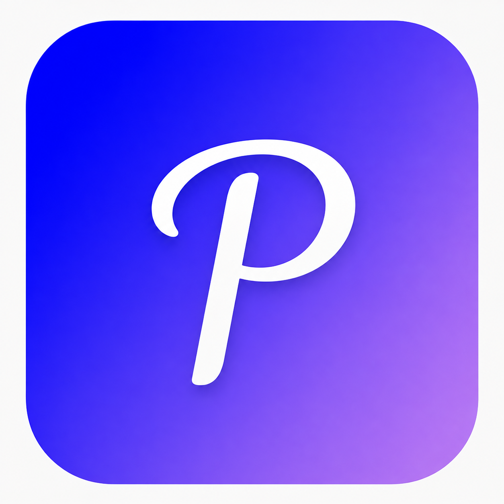
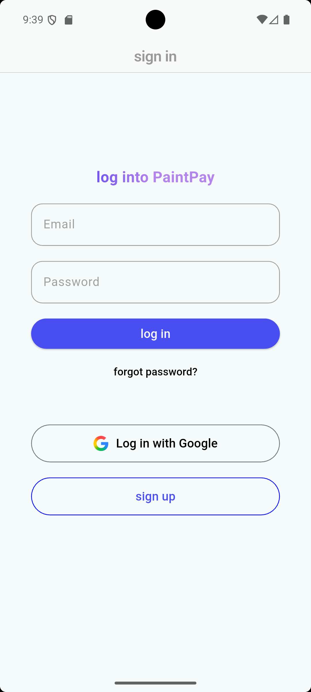
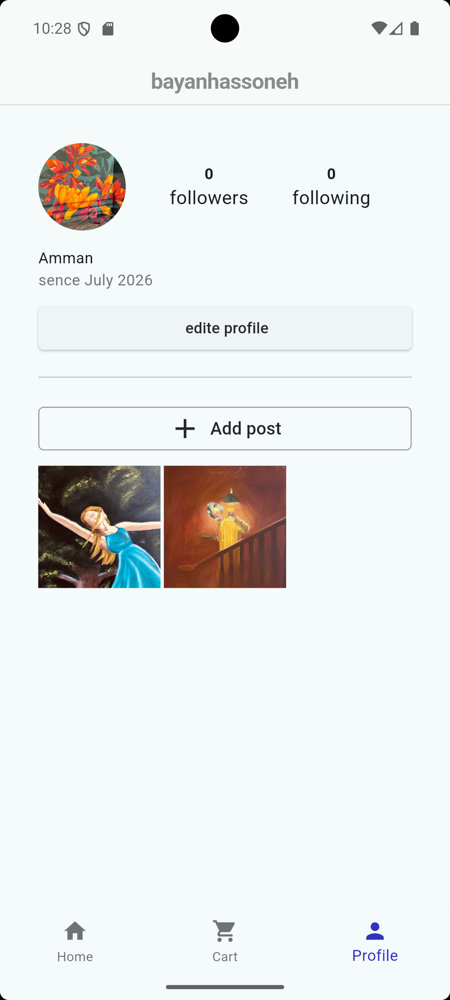
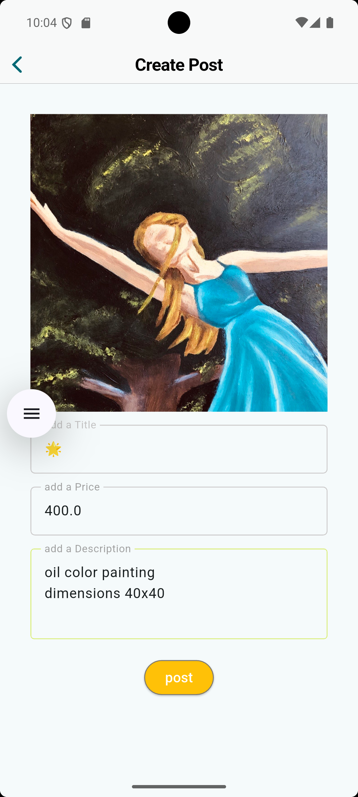
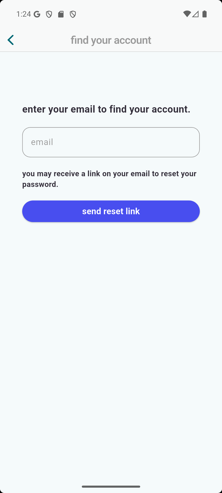
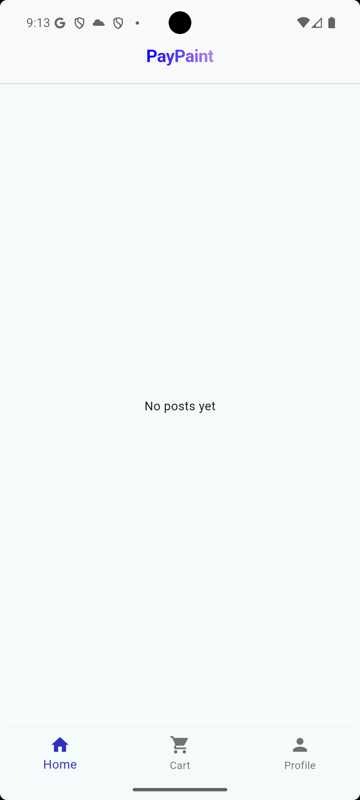
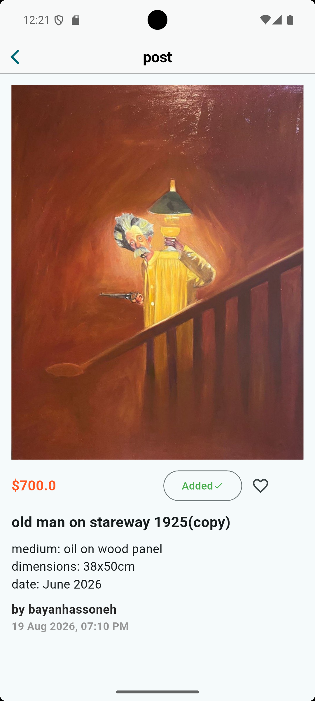
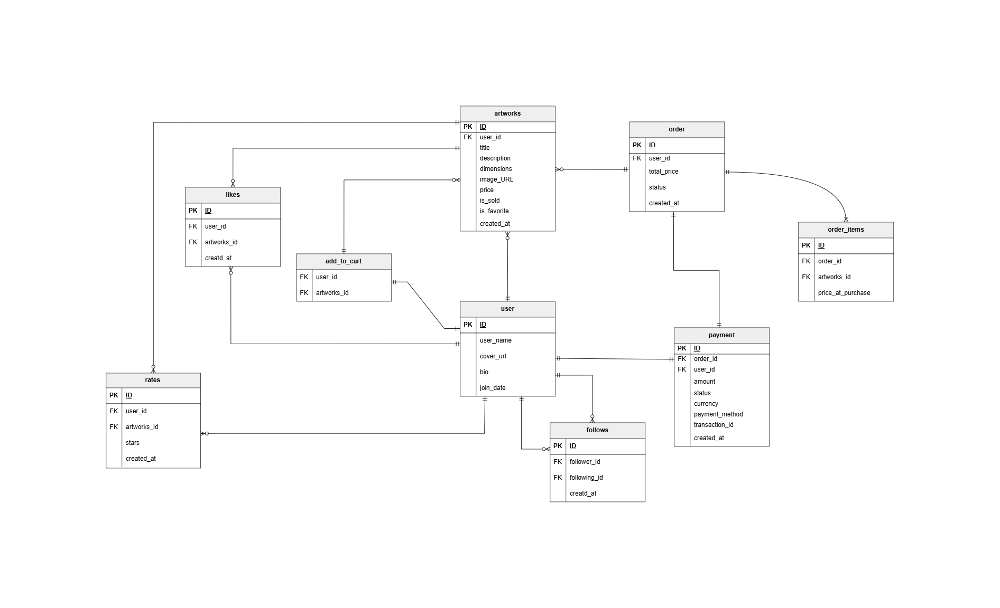

<div align="center">

  

  # Art Marketplace 

  <p>
    <a href="https://flutter.dev"></a>
    <a href="https://dart.dev"></a>
    <a href="https://supabase.com"></a>
  </p>

</div>

A mobile application built with **Flutter** and **Supabase** that allows artists to showcase and sell their mixed-media works, sculptures, and paintings.

## Overview
the Marketplace is designed to bridge the gap between local artists and art enthusiasts. It provides a clean, user-friendly interface for browsing unique artworks while ensuring secure data management and real-time updates.

## ✨ Features
* **Artist Profiles:** Dedicated spaces for artists to manage their portfolio.
* **Mixed-Media Showcase:** Support for various art forms (visual tributes, posters, sculptures).
* **Secure Authentication:** Managed via Supabase Auth.
* **Robust Backend:** Utilizing SQL triggers, Row Level Security (RLS), and optimized database schemas.
## Planned / Upcoming
* **Stripe payment integration**
## 🛠️ Tech Stack
* **Frontend:** Flutter (Dart)
* **Backend:** Supabase (PostgreSQL-manual SQL scripts)
* **State Management:** (provider)
* **Database Logic:** Custom SQL Triggers & RLS Policies.
* **App Launcher Icon:** Managed via `flutter_launcher_icons`

## 📸 Screenshots
<p align="left">
  
  
  
    
      
   
</p>

## ERD


For the full-resolution diagram:

[📄 ERD PDF](docs/ERD.pdf)

##  Technical Highlights
As an aspiring Software Engineer, I focused on:
* Implementing **Clean Code** principles and reusable UI components.
* Designing a secure database schema with **PostgreSQL** scripts via the SQL Editor. 
* Implemented strict **Row Level Security (RLS)** policies to ensure data privacy at the database level.
* * Developed custom **SQL Functions and Triggers** to automate complex data workflows and maintain integrity.
* Managing complex backend logic directly in the database to ensure data integrity.


## 📂 Folder Structure

```text
art_marketplace/
├── lib/
│   ├── core/
│   ├── models/
│   ├── providers/
│   ├── screens/
│   ├── services/
│   ├── widgets/
│   └── main.dart
├── assets/
├── database/
│   ├── triggers/
│   ├── indexes,sql
│   ├── security.sql
│   └── tables.sql
│
├── screenshots/
├── docs/
│   ├── ERD.pdf
│   └── ERD.png
├── test/
├── pubspec.yaml
└── README.md

```
  --
